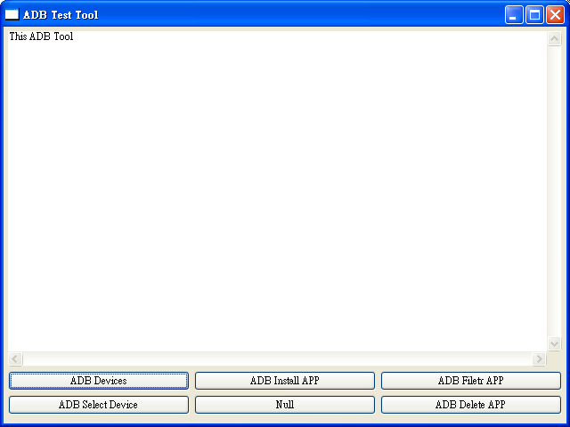
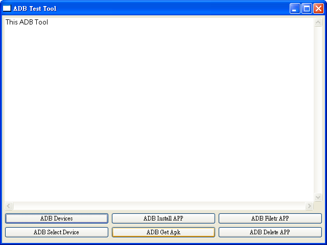
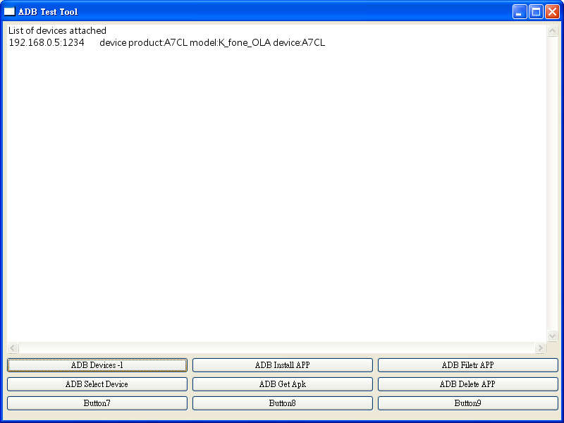
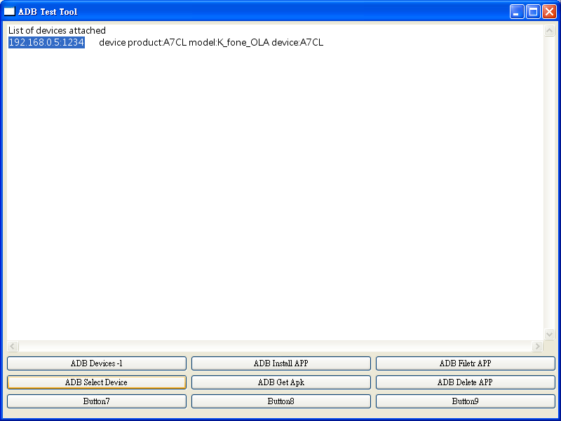

# ADB_UI
This ADB GUI Tools for JAVA SWT
 
adb ui gui

我在使用 Android adb.exe 工具時感覺很麻煩要使用到 command
就做了這個 java + swt 介面的工具，

操作上滿容易的，可以查看 Devices 以及安裝與卸載 apk
而在操作(卸載)uninstall apk 時要先在 Text 上選擇
完整的 packge 名稱如 com.example.apk 然後再選 uninstall apk

使用的 IDE 環境是：

Eclipse Java EE IDE for Web Developers.

Version: Indigo Service Release 2
Build id: 20120216-1857

Downloads:
 
<a rel="nofollow" href="https://github.com/jackeer/ADB_UI/blob/master/ADB_Install.rar">
                <strong>ADB_Install.rar</strong>
              </a>
     

操作說明

首先解壓縮 ADB_Install.rar 檔案之後會得到圖上目錄

可以直接執行ADB_Install.bat或是捷徑ADB_UI

執行畫面

按下 &quot;ADB Install APP&quot; 按鈕後會跳出開啟檔案窗選擇到要安裝的 apk 檔案後按下開啟就能夠安裝

&quot;ADB Filetr APP&quot; 按鈕第一次按下時會顯示出所有的 packges，用滑鼠括選要過濾的關鍵字後再按一次

&quot;ADB Filetr APP&quot; 按鈕

然後會顯示出只有這關鍵字的 packges，用滑鼠將包裝名選擇後按下 &quot;ADB Delete APP&quot;

就能夠完成移除 APP

新增功能 &quot;ADB Get Apk&quot;

先點選 ADB Filter APP

接著用滑鼠選擇要取得的 apk 完整包名再點選 &quot;ADB Get Apk&quot; 按鈕

完成取得 apk 了! 顯示出請檢查檔案目錄的提示

在檔案目錄底下已經有了剛剛選取得的 apk 了! 

選擇裝置之前先要把裝置給列出來

用滑鼠把裝置明稱選取後點 &quot;ADB Select Device&quot;

執行後畫面會出現裝置已經被選取，就可以執行其他各項功能操作

將裝置轉換為用網路連接模式 Tcpip 點選亮標 &quot;ADB Tcpip port&quot; 按鈕

出現 Dialog 視窗，在 Text 文字輸入裡輸入要設定的 Port 號碼 4 位數，在按下 &quot;Set Tcpip Port&quot; 鍵

如果畫面出現 (沒有回應) 則將電腦與手機裝置 usb 線給斷開，這是因為 adb.exe 被設置卡住的關係

正常設置 Tcpip port 後的畫面，設置完後點 &quot;OK&quot; 或是 &quot;Cancel&quot; 回到主畫面

再選擇到 &quot;ADB Connect Tcpip&quot; 鍵，出現 Dialog 視窗，注意 Text 輸入中的 ip 
位置改為要連接手機裝置的位置，格式不要改變為：xxx.xxx.xxx.xxx:port ，確認完後點下 &quot;Set IP : Port&quot; 鍵，此時手機不需要 
usb 線只需要 wifi 就可以與電腦連接

要回覆正常狀態要先按下 &quot;ADB DisConnect Tcpip&quot; 打開 Dialog 窗後，先按下 &quot;DisConnect&quot; 
不會顯示任何訊息，然後再用 usb 線連接上電腦與手機裝置，再按下 &quot;To Usb Mode&quot; 鍵轉回 USB 模式，一樣如果畫面卡住沒回應就先斷開 usb 
線後再接上，再多轉一次 USB 模式，此時訊息會轉回 usb 線連接才有

              